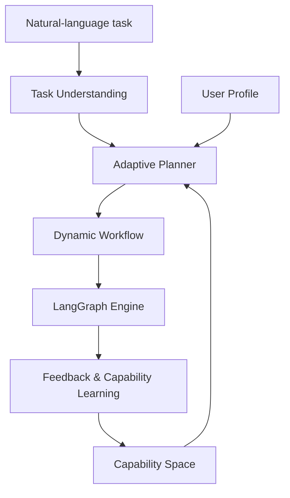

# Architecture

## Design principle

Adaptive-AGES treats an LLM, a machine-learning model, and a human as first-class execution subjects. The planner never binds a task type directly to a fixed executor. It first creates a task graph, expresses every subtask in the shared capability space, ranks available subjects, then compiles the selected graph for execution.

## Module boundaries

| Layer | Responsibility | Extension point |
| --- | --- | --- |
| Task Understanding | Goal extraction, decomposition, dependency and risk analysis | Structured-output LLM adapter or domain-specific decomposer |
| Capability Modeling | Versioned capability vectors, evidence and confidence | Benchmark import, embeddings, graph features |
| Adaptive Planner | Multi-objective matching, route generation and decision trace | Neural ranker, constraint solver, bandit or reinforcement learner |
| Executor Registry | One `execute(task, context)` contract across subject types | Custom LLM, PyTorch, sklearn, API and human executors |
| LangGraph Engine | DAG compilation, state propagation and pause/resume | Checkpointer, parallel branches, conditional edges |
| Capability Learning | Updates from outcomes, correction and disagreement | Bayesian calibration, online learning, drift detection |

## Matching objective

For task requirement vector `r` and subject capability vector `c`, the MVP uses:

`score = α · cosine(r,c) + β · reliability − γ · cost − δ · latency + risk_bonus`

The scoring contract is independent from the algorithm. A neural matcher or graph matcher can replace cosine similarity while retaining the same planning and explanation interfaces.

## Persistence model

| Table | Main role |
| --- | --- |
| `users` | Identity and user-adaptive profile |
| `agents` / `agent_capabilities` | LLM and tool subjects plus evidence-backed capability values |
| `ml_models` / `model_capabilities` | ML artifact registry, signatures and capabilities |
| `human_profiles` | Roles, availability, decision history and evolving human capability |
| `tasks` / `task_graphs` | Original goal, constraints and decomposed DAG |
| `workflows` | Versioned dynamic graph and explainable decision trace |
| `workflow_executions` | Runtime state, node outputs and pause/resume status |
| `feedback` | Human correction, rating and rationale for later capability learning |

## Phase boundaries

- Phase 1 is represented by identity, agent registry, capability matching, task planning, the React Flow studio, and LangGraph execution.
- Phase 2 adds production ML artifact loading, human work queues, availability-aware routing, and behavioral user-profile updates.
- Phase 3 consumes execution evidence to calibrate capability scores, quantify contribution and expose counterfactual route explanations.
